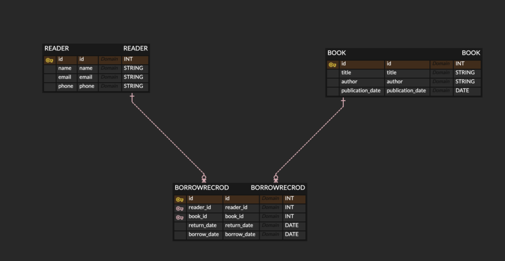

# 프로젝트 소개 - LMS

인프런 워밍업 클럽 2기 백엔드 코스에서 진행되는 프로젝트입니다.  
프로젝트는 도서관리시스템(Library Management System) 입니다.

## 기능소개

**기본기능**

- 도서 추가 : 도서를 데이터베이스에 추가
- 도서 수정 : 도서 정보 수정
- 도서 삭제 : 도서 삭제 기능
- 도서 조회 : 전체 도서 목록 조회 & 특정 도서 목록 조회

**대여 관리 기능**

- 대여 기록 추가
- 대여 기록 수정
- 대여 기록 삭제
- 반납 기록

## Dependencies

- Spring Web
- Thymeleaf
- Spring Data JPA
- mysql driver
- h2 database
- validation
- Spring Security(추후 추가 예정)

## ERD

## REST API 설계

**도서 관리 :  /books**

1. 도서 추가

- 메서드 : **POST**
- URL : **/books**
- 설명 : 도서를 데이터베이스에 추가

2. 특정 도서 수정

- 메서드 : **PUT**
- URL : **/books/{bookId}**
- 설명 : 도서 정보 수정

3. 도서 삭제

- 메서드 : **DELETE**
- URL : **/books/{bookId}**
- 설명 : 도서 삭제 기능

4. 도서 조회

- 메서드 : **GET**
- URL : **/books**
- 설명 : 전체 도서 목록 조회

5. 도서 조회

- 메서드 : **GET**
- URL : **/books/{bookID}**
- 설명 : 특정 도서 정보 조회

**대여 관리 : /rentals**

1. 대여 기록 추가

- 메서드 : **POST**
- URL : **/rentals**
- 설명 : 대여 기록 추가

2. 대여 기록 수정

- 메서드 : **PUT**
- URL : **/rentals/{rentalId}**
- 설명 : 특정 대여 기록 수정

3. 대여 기록 삭제

- 메서드 : **DELETE**
- URL : **/rentals/{rentalId}**
- 설명 : 특정 대여 기록 삭제

4. 특정 대여 기록 조회

- 메서드 : **GET**
- URL  : **/rentals/{rentalId}**
- 설명 : 특정 대여 기록 조회

5. 반납 기록 조회

- 메서드 : **GET**
- URL : **/rentals**
- 설명 : 전체 반납 기록 조회

6. 특정 반납 기록 조회

- 메서드 : **GET**
- URL : **/rentals/{rentalId}**
- 설명 : 특정 반납 기록 조회